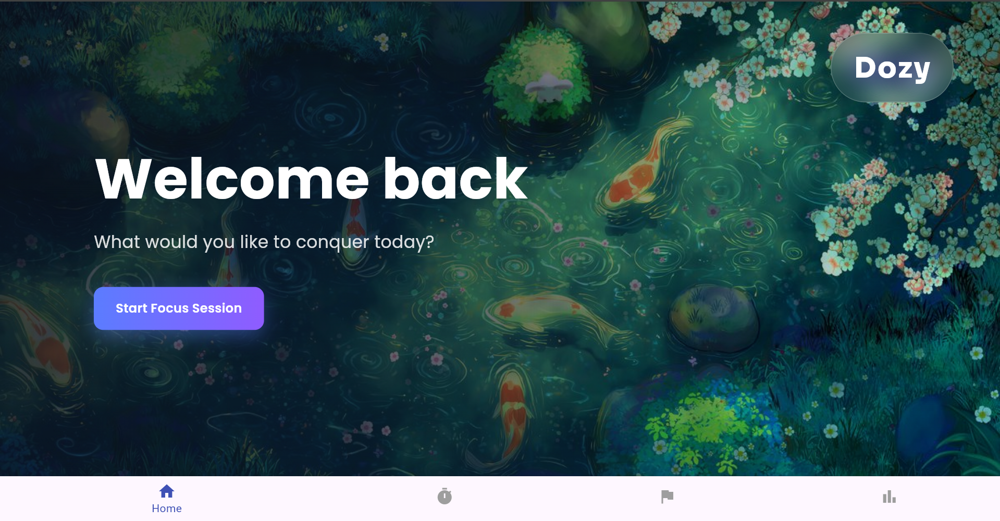
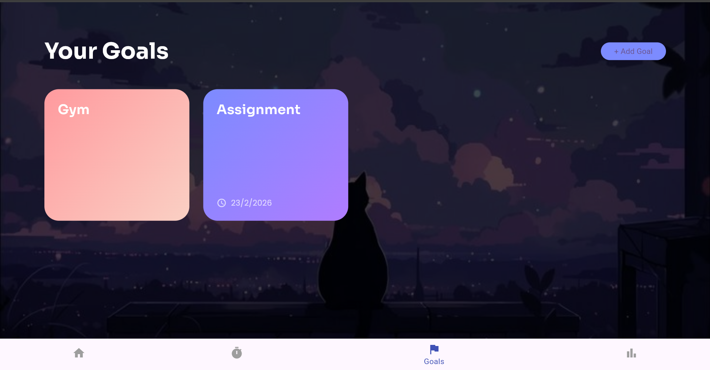
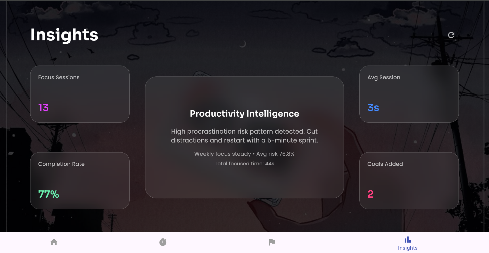

# 🚀 Dozy — Anti-Procrastination Using ML for Context aware Productivity

Dozy is a context-aware productivity assistant that combines:
- 🎯 Focus Timer
- 🧠 ML-Based Procrastination Prediction
- 📊 Insight Analytics
- 🎯 Goal Management
- ☁ Supabase Cloud Database
- ⚡ FastAPI ML Backend

Built using **Flutter (Web/Desktop)** + **FastAPI** + **Supabase**.

---

## 🌟 Features

### 🏠 Home Screen
- Clean, aesthetic desktop UI
- Glassmorphism design
- Instant navigation to focus mode
  ## 🏠 Home Screen
  

### ⏳ Focus Mode 
- Customizable timer (HH:MM:SS)
- Resume / Pause / Stop support
- Circular animated progress indicator
- Background live video support
- Calls ML backend to predict procrastination risk
- AI feedback when stopping mid-session
  ## 📊 Focus Screens
  
  

### 🧠 ML-Powered Procrastination Detection
- Trained on behavioral & task data
- Returns:
  - `procrastination_prediction`
  - `risk_score`
- High recall & F1 optimized model
- Integrated via FastAPI

### 🎯 Goals System
- Add / delete goals
- Optional deadline
- Saved in Supabase
- Data persists across sessions
  ## 🎯 Goals Screen


### 📊 Insights Dashboard
- Focus streak
- Average session duration
- Distraction trend
- Goal completion %
- Calculated from real Supabase data
  ## 📊 Insights Dashboard


# 🧠 Tech Stack

| Layer        | Technology |
|-------------|------------|
| Frontend    | Flutter (Web/Desktop) |
| Backend     | FastAPI |
| ML Model    | Scikit-learn |
| Database    | Supabase (PostgreSQL) |
| Auth        | Supabase Auth |
| Video       | Flutter video_player |

---

# 🛠 Project Structure

```

Dozy/
│
├── frontend/ (Flutter App)
│   └── lib/
│
├── backend/ (FastAPI + ML Model)
│   ├── main.py
│   ├── dozy_model.pkl
│
├── assets/
│   ├── home.png
│   ├── focus_running.png
│   ├── focus_stopped.png
│   ├── goals.png
│   ├── insights.png
│
└── README.md

````

---

# ⚙️ How To Run Locally

---

## 🧠 1️⃣ Run Backend (FastAPI + ML)

### Step 1 — Navigate to backend folder

```bash
cd dozy_backend
````

### Step 2 — Create Virtual Environment

```bash
python -m venv venv
```

Activate:

Windows:

```bash
venv\Scripts\activate
```

Mac/Linux:

```bash
source venv/bin/activate
```

### Step 3 — Install Dependencies

```bash
pip install fastapi uvicorn scikit-learn pandas joblib
```

### Step 4 — Start Server

```bash
uvicorn main:app --reload --host 0.0.0.0 --port 8000
```

Server runs at:

```
http://localhost:8000
```

Swagger Docs:

```
http://localhost:8000/docs
```

---

## 🎨 2️⃣ Run Flutter Frontend

### Step 1 — Go to frontend folder

```bash
cd dozy
```

### Step 2 — Install Dependencies

```bash
flutter pub get
```

### Step 3 — Run App (Web)

```bash
flutter run -d chrome
```

Or Desktop:

```bash
flutter run -d windows
```

---

# ☁ Supabase Setup

1. Create project at [https://supabase.com](https://supabase.com)
2. Run SQL schema (included in project)
3. Copy:

   * Project URL
   * Public anon key
4. Add to Flutter:

```dart
await Supabase.initialize(
  url: 'YOUR_SUPABASE_URL',
  anonKey: 'YOUR_PUBLIC_ANON_KEY',
);
```

---

# 🤖 ML Input Features

The model uses:

* start_delay_min
* last_minute_rush
* focus_rating
* distractions_count
* coffee_intake_mg
* task_quality_score
* stress_level
* complexity_low
* complexity_medium

Optimized for high recall and F1-score.

---

# 🔐 Security

* Row Level Security (RLS) enabled
* User-specific data isolation
* No service role key exposed in frontend

---

# 👩‍💻 Developed By

Sanskriti


